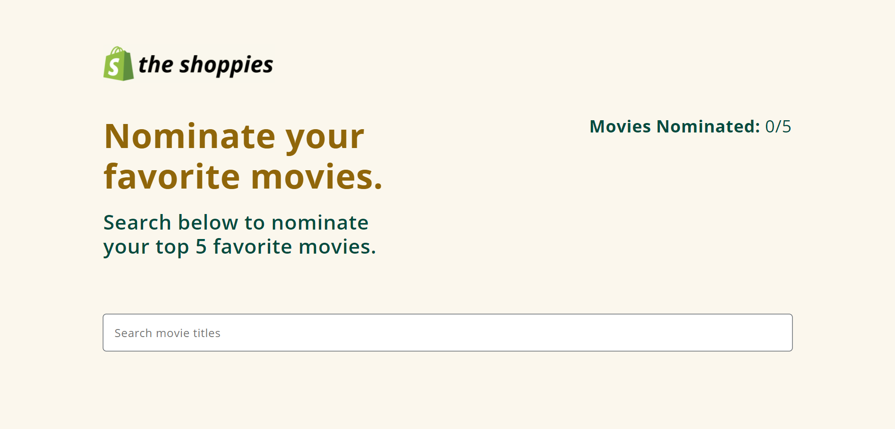

# The Shoppies

## Project Description

The Shoppies is a movie nomination application created as part of the application process for the Shopify Fall 2021 Frontend Developer Internship. This app allows users to search for films and save their favorite films that they feel should be up for nomination. When they have selected 5 nominees, they should be notified that they are finished.

## The Shoppies Live Link

Please check out the live link for The Shoppies here: [The Shoppies](https://the-shoppies-priceless-kare.netlify.app/ "The Shoppies")

## Table of Contents
* [The Challenge](#The-Challenge)
* [My Approach](#My-Approach)
* [Technologies Used](#Technologies-Used)
* [Screenshots](#Screenshots)
* Express

## The Challenge

Create a webpage that can search OMDB for movies, and allow the user to save their favorite films they feel should be up for nomination. When they've selected 5 nominees they should be notified they're finished.

### Requirements

* Simple to use interface
* Search OMDB's API and display the results (movies only)
* Add a movie from the search results to the nomination list
*	View the list of films already nominated
*	Remove a nominee from the nomination list
*	Each search result should list at least its title, year of release, and a button to nominate that film
*	Updates to the search terms should update the result list
*	If a search result has already been nominated, disable its nominate button
*	Display a banner when the user has 5 nominations

### Extras

Improvements to design and functionality are allowed. Crafting a nicer design, or improving the app by adding new features can be added to best showcase your passion and skills. The following image was provided as a reference:

[Back To Top](#Table-of-Contents)

## My Approach

### Organization

In creating this app, I began with the overall structure and organization of the folder structure. Since I knew I was going to use React, I created a **components** folder where the components would go. Inside the **components** folder, I also created a **misc** folder for other components, like the loading spinner. I also created a **utilities** folder inside for the useDebounce Hook that I used for debouncing to prevent API calls from being fired on every keystroke. As I decided to use CSS Modules for the styling, I created a separate styles folder inside the **src** folder and created a separate CSS file for each component. I also created a separate **img** folder for the images used, as well as the spinner gif. I began with the functionality of the app (e.g., fetching the data, dsiplaying the data, nominating a movie, etc.), only adding styling as needed in the beginning. As I continued to get more of the functionality working, I moved more and more to the layout and the styling. As I completed the functionality, I focused more on the styles and details of the design.

### Design

For the design, I wanted to keep it within family of the existing brand. That way, the application would have the trust of the Shopify brand, and the winner would carry more impact. For this, I referred to the [Shopify](https://www.shopify.com/ "Shopify's Homepage") website in order to see what kind of layout, color, logos, and typograpy were used. In creating the design for my application, I used this as a reference in the selection of colors, font style, etc. used in my application. I focused on the details, by using the same logo used as the favicon, as well as creating an image on [Canva](https://www.canva.com/ "Canva") using the same logo and font to use for the Open Graph Meta Tag image.

### Development

In terms of developing the application, I decided to build the app using React and CSS Modules. I decided to use pure CSS, instead of using frameworks, and used Flexbox and media queries to create an application that would be responsive on both desktop and mobile devices. To provide a better user experience, I used minimal animations from React Transition Group and Animista.

[Back To Top](#Table-of-Contents)

# Technologies Used

* React (Hooks)
* OMDB API
* Flexbox
* Local Storage
* React Transition Group
* Animista
* CSS
* SweetAlert2
* Google Fonts
* Facebook Developer Tools (Sharing Debugger)
* Canva
* Netlify

[Back To Top](#Table-of-Contents)

# Screenshots

