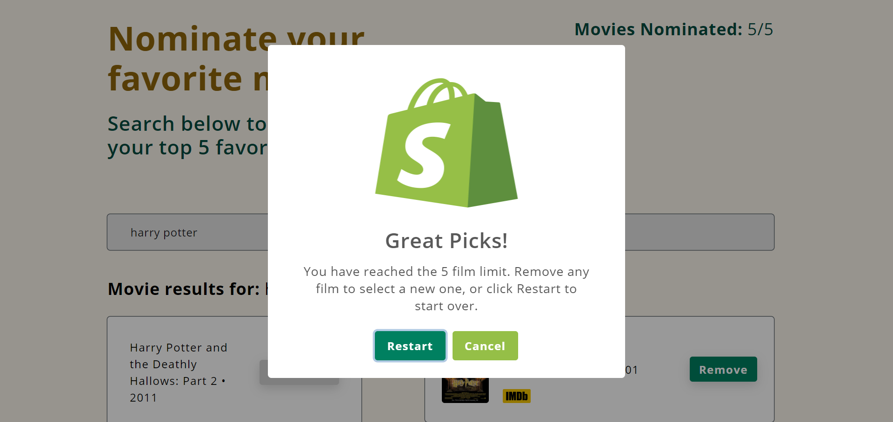

# The Shoppies


## Project Description

The Shoppies is a movie nomination application created as part of the application process for the Shopify Fall 2021 Frontend Developer Internship. This app allows users to search for films and save their favorite films that they feel should be up for nomination. When they have selected 5 nominees, they should be notified that they are finished.

## The Shoppies Live Link

Please check out the live link for The Shoppies here: [The Shoppies](https://the-shoppies-priceless-kare.netlify.app/ "The Shoppies")

## Table of Contents
* [The Challenge](#The-Challenge)
* [My Approach](#My-Approach)
* [Technologies Used](#Technologies-Used)
* [Extra Features](#Extra-Features)
* [Screenshots](#Screenshots)

## The Challenge

Create a webpage that can search [OMDB](http://www.omdbapi.com/ "OMDB") for movies, and allow users to save their favorite films they feel should be up for nomination. When they've selected 5 nominees they should be notified they're finished.

### Requirements

* Simple to use interface
* Search OMDB's API and display the results (movies only)
* Add a movie from the search results to the nomination list
*	View the list of films already nominated
*	Remove a nominee from the nomination list
*	Each search result should list at least its title, year of release, and a button to nominate that film
*	Updates to the search terms should update the search results list
*	If a search result has already been nominated, disable its nominate button
*	Display a banner when the user has 5 nominations

### Extras

Improvements to design and functionality are allowed. Crafting a nicer design, or improving the app by adding new features can be added to best showcase your passion and skills. The following image was provided as a reference:


[Back To Top](#Table-of-Contents)

## My Approach

### Organization

In creating this app, I began with the overall structure and organization of the folder structure. Since I knew I was going to use React, I created a `components` folder where the components would go. Inside the `components` folder, I also created a `misc` folder for other components, like the loading spinner. I also created a `utilities` folder inside for the useDebounce Hook that I used for debouncing to prevent API calls from being fired on every keystroke. As I decided to use CSS Modules for the styling, I created a separate `styles` folder inside the `src` folder and created a separate CSS file for each component in order to keep the CSS class names scoped locally. I also created a separate `img` folder for the images used, as well as for the spinner gif. Finally, I created a `.env.local` file and added it to the `.gitignore` file so that the OMDB API key cannot be seen publicly. I began with the functionality of the app (e.g., fetching the data, displaying the data, nominating a movie, etc.), only adding styling as needed in the beginning. As I continued to get more of the functionality working, I moved more and more to the layout and the styling. As I completed the functionality, I focused more on the styles and details of the design, including working on making it responsive across various screen sizes, which I achieved by using Flexbox, media queries, and the Responsively App.

### Design

For the design, I wanted to keep it within the family of the existing brand. That way, the application would have the trust of the Shopify brand, and the winner would carry more impact. For this, I referred to the [Shopify](https://www.shopify.com/ "Shopify's Homepage") website in order to see what kind of layout, color, logos, and typograpy were used. In creating the design for my application, I used this as a reference in the selection of colors, font style, etc. used in my application. I focused on the details by using the same logo for the favicon and logo on the app, as well as creating an image on [Canva](https://www.canva.com/ "Canva") using the same logo and typography to use for the Open Graph Meta Tag image.

### Development

In terms of developing the application, I decided to build the app using React and CSS Modules. I decided to use pure CSS, instead of using frameworks, and used Flexbox and media queries to create an application that would be responsive on both desktop and mobile devices. To provide a better user experience, I used animations from [React Transition Group](http://reactcommunity.org/react-transition-group/ "React Transition Group") and [Animista](https://animista.net/ "Animista"). I used React Transition Group for the fade in and fade out effect when adding and removing movies. Animista was used on the IMDB image logo on the nominated movie cards to provide a nice horizonal jello effect when a nominated movie card is added. For the banner, I decided to use a pop up message to notify the user that 5 movies have been nominated. For this, I used [SweetAlert2](https://sweetalert2.github.io/ "SweetAlert2"), which provides attractive and customizable alert messages. Once users see this banner, they are given the choice of either removing a film in order to add a new one, or restarting the application.

[Back To Top](#Table-of-Contents)

## Technologies Used

* React (Hooks)
* OMDB API
* Local Storage
* React Transition Group
* Animista
* CSS (CSS Modules)
* Flexbox
* SweetAlert2
* Google Fonts
* Facebook Developer Tools (Sharing Debugger)
* Canva
* Netlify

[Back To Top](#Table-of-Contents)

## Extra Features

### Debounce

To prevent API calls from being fired on every keystroke, a debounce custom hook is used in conjunction with useEffect to delay the API call until the user finishes typing. This ensures that expensive operations, as in the API calls here, are not executed too frequently. The improvement can be seen when looking at the Network tab in the console when making the API calls. In this first example, debouncing is not used. As you can see, API calls are being made with every keystroke. This can be clearly seen in the Network tab. In addition to causing issues with performance, having new information appear with every keystroke can be chaotic and inefficient.


In comparison, you can see the improvement in the Network tab when debouncing is used. As you can see, although the same API call is being made (i.e., searching for "harry potter"), the API calls are not executed as frequently as when debouncing is not used. Instead of making API calls with every keystroke, the debounce hook forces the function that is fetching the data to wait a certain amount of time (500ms) before running again. The hook, then, limits the number of times the function is called. As you can see in the Network tab in the example below, this is much more efficient.


### Local Storage

To provide for a better user experience, movies that are nominated by a user are stored in local storage, so that the nominated movies are preserved in local storage when they are nominated and added to the Nominations list. Likewise, when movies are removed from the Nominations list, they will remain removed from the list when the page is refreshed. By adding local storage, the information is not lost when a user refreshes the page.

In this code snippet, nominated movies are saved to local storage. In order to retrieve the movies stored in local storage whenever the app loads, the useEffect Hook is a good place to do this, since the useEffect Hook always runs when the app loads for the first time. Although not shown in the snippet below, using local storage also ensures that nominated movies that are removed from the list no longer remain in local storage.

```
  // Get from local storage when app first loads
  useEffect(() => {
    const moviesNominated = JSON.parse(localStorage.getItem('shoppies-movies'));
    if (moviesNominated) {
      setNominate(moviesNominated);
    }
  }, []);

  // Save nominated movies to local storage
  const saveLocalStorage = (items) => {
    localStorage.setItem('shoppies-movies', JSON.stringify(items));
  };
```
When the user has selected all 5 movie nominations, and decides to restart the app, all of the movies that were stored in local storage will no longer be in local storage. As you can see from the handleRest function, which resets the app, saveLocalStorage is set to an empty string, which clears everything from local storage.

```
  // Reset when Restart button is clicked
  const handleReset = () => {
    setIsLoading(false);
    setMovies([]);
    setNominate([]);
    setSearchItem('');
    saveLocalStorage('');
  };
  ```

### Loading Spinner

A separate spinner component was created to let the user know that something is happening if the API does not respond right away. A gif is used for the spinner.

```
import React from 'react';
import spinner from '../../img/spinner.gif';

const Spinner = () => (
  
);

export default Spinner;
```

This spinner component is used in the MovieList component to show the user that the movie that has been typed in is being searched for if the API does not respond immediately.
```
{!props.isLoading ? <div className='text-center'></div> : <Spinner />}
```

### IMDB Links

Nominated movies allow the user to open the movie page on the IMDB website in a separate window. To do this, I used the IMDB logo image that the user can click on to open the page. This was done by taking the IMDB ID (`imdbID`) and adding it dynamically to the `a href` so that the user could go to the IMDB page for each movie clicked on.


### Facebook Crawler

Facebook Crawler from the Facebook Developer Tools suite was used to crawl the live application. Doing this allows one to see the information that is used when the application content is shared on Facebook, Messenger, and other places. Open Graph markup was done in the `index.html` file, which allowed me to customize how the application's URL and information is displayed when shared and posted on social media.


[Back To Top](#Table-of-Contents)

## Screenshots




[Back To Top](#Table-of-Contents)
