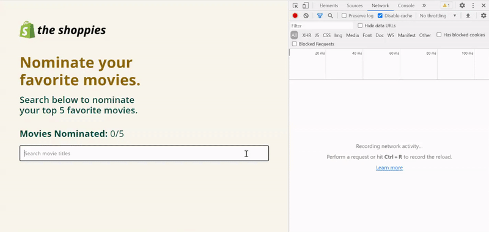

# The Shoppies

## Project Description

The Shoppies is a movie nomination application created as part of the application process for the Shopify Fall 2021 Frontend Developer Internship. This app allows users to search for films and save their favorite films that they feel should be up for nomination. When they have selected 5 nominees, they should be notified that they are finished.

## Table of Contents
* [The Challenge](#The-Challenge)
* [Screenshots](#Screenshots)
* Express

## The Challenge

Create a webpage that can search OMDB for movies, and allow the user to save their favorite films they feel should be up for nomination. When they've selected 5 nominees they should be notified they're finished.

### Requirements

* Simple to use interface
* Search OMDB's API and display the results (movies only)
* Add a movie from the search results to the nomination list
*	View the list of films already nominated
*	Remove a nominee from the nomination list
*	Each search result should list at least its title, year of release, and a button to nominate that film
*	Updates to the search terms should update the result list
*	If a search result has already been nominated, disable its nominate button
*	Display a banner when the user has 5 nominations

### Extras

Improvements to design and functionality are allowed. Crafting a nicer design, or improving the app by adding new features can be added to best showcase your passion and skills.

[Back To Top](#Table-of-Contents)

# Technologies Used

* MongoDB
* Express
* React
* Node
* NPM packages: Axios, React Router, React Transition Group, React Helmet, bcryptjs, UUID, Express-Validator, Mongoose, Rebass, and SweetAlert
* Animate.css
* CSS
* Font Awesome
* Google Fonts

# Lucky Student Live Link

Please check out the live link for Lucky Student here:

https://lucky-student.com/

# Lucky Student Demo Video

To learn how to use Lucky Student, watch the [demo video](https://drive.google.com/file/d/17FBhEFrC3Xtjt-E-yz6EzhT0A5T-NbPU/view).

# Screenshots

